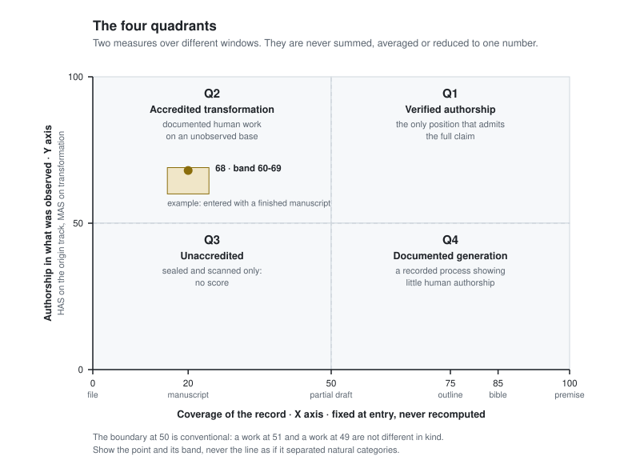

# Open AWAP 2.0 — Specification

**Augmented Writing Audit Protocol** · Rais Busom · September 2026 · CC BY 4.0

Keywords: MUST, MUST NOT, SHOULD, MAY as in RFC 2119.

v2.0 replaces v1.0 in full and is not backwards compatible
([`legacy/SPEC-v1.0.md`](legacy/SPEC-v1.0.md)).

---

## 1. Principles

1. **AWAP certifies what it observed, never what it infers.** No component of this protocol
   derives from an analysis of the finished text.
2. **Origin is not recoverable after the fact.** No detector, watermark reader or stylometric
   distance establishes who wrote a text that was not observed being written.
3. **Two measures, never one.** Coverage and the score answer different questions over different
   windows. Combining them destroys both (§7).
4. **What the author declares is recorded as a declaration**, marked as unverified, and never
   promoted to a fact.
5. **A low score MUST be reachable.** A protocol whose scale cannot report "mostly generated" is a
   provenance laundry, not an audit.

---

## 2. Data model

### 2.1 Entities

| Entity | Description |
|---|---|
| Work | The unit certified. Holds the entry point, the track and the version chain. |
| Event | An append-only record of something that happened (§2.3). |
| Version | A sealed state of the manuscript, identified by the hash of its bytes. |
| Declaration | The author's statement about the origin of a pre-existing base. |
| Position | The pair (coverage, score) with its quadrant — never a single figure. |

### 2.2 Critical fields of the work

| Field | Rule |
|---|---|
| `entry_point` | One of §3.1. **Immutable**: an implementation MUST reject any write to it after creation. |
| `entry_ts` | Timestamp of entry. Immutable. Start of the observation window. |
| `coverage` | Derived from `entry_point` (§3.1). Immutable. |
| `track` | Derived from `entry_point` (§3.2). Immutable. |
| `baseline` | Transformation track only: `{version_id: "V0", sha256, words, provenance_scan, origin_declaration}`. |
| `declaration_verified` | MUST be the literal `false`. It is not a flag: AWAP does not verify declarations. |
| `has_version` | The identifier of the weight set used (§5.4). |
| `signature` | Integrity of the record (§8.2). |

### 2.3 Event types

| `event_type` | Meaning | Required fields |
|---|---|---|
| `work.create` | The work entered the registry | `entry_point`, `entry_ts`, `coverage`, `track` |
| `version.seal` | A state of the manuscript was sealed | `version_id`, `sha256`, `words` |
| `declaration.sign` | The author signed an origin declaration | `options[]`, `hash`, `ts` |
| `document.create` | The human authored a foundational document | `document_type`, `words`, `ts` |
| `text.generated` | An AI generated text | `ai_model`, `words`, `agent`, `instruction_words` |
| `text.human` | The human wrote text directly | `words` |
| `decision` | The human decided on a proposal | `ref`, `decision` ∈ {`accepted`, `edited`, `discarded`}, `method`, `similarity?` |
| `decision.nonliteral` | The human decided on plot, character, POV, chronology or ending | `ref`, `scope`, `method` |
| `session.start` / `session.end` | Session boundaries | `ts` |

Events MUST be append-only and MUST be written with the intention recorded **before** execution
and closed with the result, so that a crash leaves a trace instead of silence.

`method` on a decision records **how it is known**, and an implementation MUST report it:
`explicit` (the author pressed a control) > `reconciliation` (derived by comparing the manuscript)
> `presence` (a heuristic). A derived datum MUST NOT be presented as a declared one.

---

## 3. Entry, coverage and tracks

### 3.1 Coverage anchors (X axis)

Coverage is a **discrete position**, not an index. It is set once, at entry, from the state of the
work at that moment, and it is never interpolated and never recomputed.

| `entry_point` | Condition | `coverage` |
|---|---|---|
| `premise` | Not one word of the work exists | 100 |
| `bible` | Premise or synopsis already written outside the record | 85 |
| `outline` | Structure exists outside the record; no prose | 75 |
| `partial_draft` | Prose exists, incomplete | 50 |
| `manuscript` | A complete manuscript exists | 20 |
| `file` | Only the finished file; no process will follow | 0 |

The entry point is **declared by the author** at entry. Coverage therefore measures *from when the
record exists*, and an implementation MUST NOT describe it as proof of what existed before.

### 3.2 Derivation of the track

`track = origin` if `entry_point` ∈ {`premise`, `bible`, `outline`}, otherwise
`track = transformation`. The author MUST NOT be able to choose it directly.

### 3.3 Transformation track: sealing, scan and declaration

On entry, an implementation MUST:

1. **Seal V0** — the SHA-256 of the file's **bytes**, not of extracted text: a third party must be
   able to recompute it.
2. **Run a provenance scan** of V0 and store the result **whole, whatever it says** — or, if it
   could not run, the reason. An absent scan stored silently would be a false statement by
   omission. A conformant report MUST carry this sentence literally:

   > Finding no marks never means the text is human. Model text watermarks have no public
   > detector. This scan documents declarations found in the file; it does not adjudicate.

3. **Block until the author signs an origin declaration** — free text plus non-exclusive options
   (`author`, `third_party`, `ai_assisted`, `ai_generated`, `unknown`, `declines`). Until it is
   signed, no version may be sealed and no certificate may be issued.

### 3.4 Mixed works

Works with both registered origin and a declared base are reported as extensions over the **same
denominator** — the final text — because those add to 100% by construction:

> Of the final text: 38% with recorded origin, 62% derived from a declared baseline.

---

## 4. The Y axis: score over the observed window

### 4.1 Definition

The score is computed **with the same formula on both tracks**, over the recorded window only —
from `entry_ts` to issuance. One scoring engine, one window parameter. That is why the two axes
are orthogonal and why they can be shown together although they can never be averaged.

### 4.2 Name of the axis

On the Origin track the axis is the **HAS** (Human Authorship Score). On the Transformation track
the same number MUST be reported under a distinct name — the reference implementation uses **MAS**
(Manuscript Authoring Scoring) — because a figure computed over a work with no recorded origin
must not be comparable, by name, with one that has it. Same formula, same weights, different
name.

### 4.3 Components

All derived from events, none from the text itself.

| Component | Signal | Weight (`2.1`) |
|---|---|---|
| `pure_human_text` | words of the final text never produced by a generation that was kept | 5 |
| `nonliteral_decisions` | `decision.nonliteral` with a human actor, over decisions in the window | 4 |
| `subsequent_intervention` | of what was kept, how much was reworked — **graded** by `1 − similarity` when a reconciliation measured it, counted whole when the author declared it | 3 |
| `documentary_precedence` | documents of the hierarchy created before the first generation | 2 |
| `selection_and_rejection` | `discarded` over decided proposals | 2 |
| `direction` | human instruction volume over generated volume, capped at 1 | 1 |
| `temporal_continuity` | distinct days with recorded work, saturating at a published threshold | 1 |

### 4.4 Computation rules

1. A component **with no data is excluded and renormalised**; it MUST NOT be imputed. The
   certificate MUST list which components took part and which did not.
2. **With no generation events in the window there is no score**: the position is Q3 and the
   certificate states that there is no recorded process. Scoring 100 for "no AI text conserved"
   over a work nobody watched being written would certify what was not observed (§1.1).
3. AI used **during rewriting** on the Transformation track is recorded and penalised exactly as
   on the Origin track. This is the most important rule in the specification.
4. The score MUST be reported as an **exact integer 0–100 together with its band of 10**. Neither
   alone: the exact value is what a registrar or a platform asks for, and the band is the honest
   statement of its precision.

### 4.5 Weights are policy

The weights are a claim about what counts as authorship, and whoever publishes them will have to
defend them in public. An implementation MUST publish them, MUST carry their identifier
(`has_version`) in every certificate, and MUST NOT change them within a project without
recomputing and making the change visible. Two scores with different `has_version` are not
comparable.

The reference weight set `2.1` is the table in §4.3. It follows the distinction drawn by the U.S.
Copyright Office in January 2025: human expression perceptible in the result and creative
modification establish authorship; prompting and choosing among outputs, on their own, do not.

### 4.6 Transformation depth (Transformation track, informative, **not** in the score)

Three levels, reported separately and never averaged together:

- **Literal** — surviving verbatim sentences, edit distance, share of rewritten paragraphs.
- **Structural** — scenes added, cut, reordered, merged, split.
- **Non-literal** — changes to character, POV, chronology, ending, theme. Not reliably automatable;
  declared, and the chapters affected are named.

It MUST be accompanied by a per-chapter distribution. A rewrite concentrated in the first three
chapters must be visible, not averaged away.

---

## 5. Quadrants

Conventional boundary at 50 on both axes.

<picture>
  <source media="(prefers-color-scheme: dark)" srcset="examples/quadrants-dark.svg">
  
</picture>

| Quadrant | Position | Name | Semantics |
|---|---|---|---|
| Q1 | X high, Y high | Verified authorship | The only position that admits the full claim |
| Q2 | X low, Y high | Accredited transformation | Documented human work on an unobserved base |
| Q3 | X low, Y low | Unaccredited | Sealed and scanned only. No score |
| Q4 | X high, Y low | Documented generation | A recorded process showing little human authorship |

With no score (§4.4.2) the position is Q3 regardless of coverage.

An implementation MUST show the point and its band and MUST NOT present the boundary as if it
separated natural categories: a work at 51 and a work at 49 are not different in kind.

---

## 6. Composition

### 6.1 Forbidden

Summing or averaging coverage and the score, in any form, including a weighted average "for
internal use only". Reasons: the denominators differ (the score's is the observed window,
coverage is a position in a timeline); the epistemic status differs (the score rests on observed
facts, coverage on the Transformation track also rests on an unverified declaration, and averaging
them erases that boundary — the weight chosen is, in secret, a price put on the author's word);
and in practice, the moment a single number exists it is the only one anyone reads, and it leaves
one surface to attack in a dispute.

### 6.2 Permitted

Extensions over the same denominator — the final text — as in §3.4.

---

## 7. The certificate

### 7.1 Fixed structure

Every issuance MUST carry these sections, in this order. **The origin section does not disappear
on the Transformation track: it stays visibly empty.**

```
1. Identification of the work and the author
2. ORIGIN
     Origin track:        documentary chain from the first document
     Transformation track: [NOT RECORDED] + entry date + author's declaration
3. RECORDED PROCESS
     window, sessions, events, version chain
4. POSITION
     coverage (anchor) · score (exact value + band) · quadrant · has_version
5. TRANSFORMATION        (Transformation track only: three levels + per-chapter map)
6. DECLARED AND RECORDED AI USE
7. WHAT THIS CERTIFICATE DOES NOT ACCREDIT
8. HASH CHAIN AND SIGNATURE
```

### 7.2 Section 7 (normative, fixed text)

Mandatory in every issuance, verbatim:

> - This certificate does not accredit the origin of any text predating the date of entry into
>   the registry.
> - It contains no AI-generated-text detector and does not rely on one.
> - It does not claim the work is "human", "AI-free", or any single percentage of humanity.
> - Coverage and the score are different measures over different windows: they are not summed and
>   they are not compared across quadrants.
> - AWAP does not prevent fraud: it makes the certificate state only true things.

### 7.3 Wording by quadrant (normative)

These sentences MUST NOT be paraphrased, subject to the three conditions in §7.4.

**Q1 — Verified authorship**
> The creation process of this work is recorded from its first document, dated [X]. The record
> shows [n] sessions over [period] and the version chain is reversible and verifiable.

**Q2 — Accredited transformation**
> This work entered AWAP on [date] as a pre-existing manuscript. **AWAP has not verified and
> cannot verify its origin.** The author declares: "[declaration]". Since entry, the following has
> been recorded: [transformation]. What this certificate documents is the work done from that date
> onwards.

**Q3 — Unaccredited**
> The file identified by [hash] was sealed on [date]. There is no recorded process. AWAP can state
> nothing further about this work.

**Q4 — Documented generation**
> The creation process of this work is recorded from [entry point]. The record shows that most of
> the text was generated by AI under human direction. This statement is exact and is supported by
> the record.

### 7.4 Conditions on the normative wording

Truthfulness overrides the template. In these three cases the implementation MUST depart from it
and MUST state why in the certificate:

1. **Q4 when the record does not support the claim.** The Q4 sentence asserts that most of the
   text was generated by AI. A low score does not imply it: with a flat-ish weight set, few
   decisions and a single working day can sink the score over a text that is almost entirely the
   author's. The sentence MUST be used only when `pure_human_text` is known and below 0.5. If it
   is known and above, or unknown because the final manuscript was not provided, the certificate
   MUST report the position without that claim.
2. **Transformation track landing in Q1.** Possible at the boundary (`partial_draft`, coverage 50).
   The Q1 sentence would assert a recorded origin, which §7.5 forbids on this track. The Q2
   sentence MUST be used instead.
3. **Q3 with no sealed file.** There is no hash to cite; the sentence MUST say so instead of
   citing one.

### 7.5 Wording prohibitions

Never, on any track, in the certificate or in any derived material:

- "human work", "written by a human", "AI-free" without the explicit window;
- any claim about origin on the Transformation track, even hedged or conditional;
- a single percentage of humanity of the work;
- comparison of scores across different quadrants, or across different `has_version`.

---

## 8. Integrity, signature and verification

### 8.1 Artifacts

| Artifact | Description |
|---|---|
| Certificate document (e.g. PDF) | Human-readable, the eight sections of §7.1 |
| JSON-LD credential | Machine-readable (§8.4), SHA-256 integrity, verifiable offline |
| Record | The work's own file: entry point, versions, declaration, signature |

### 8.2 Signature of the record (local)

The record MUST carry a hash covering **everything the certificate prints as fact**: entry point,
entry timestamp, coverage, track, baseline hash, title, author, the origin declaration and the
version chain. An implementation MUST recompute it on read and MUST report the record as
**tampered** when it does not match; it MUST refuse to write over a tampered record, because
re-signing would bless the edit.

This is a local integrity check, and a conformant implementation MUST say so in the certificate:
it detects a hand edit made without recomputing it; it is not a public signature and proves
nothing against someone who recomputes it.

### 8.3 Public anchoring

A certificate is **provisional** until its `cert_hash` is anchored in a public registry that a
third party can query without an account. Only hashes are anchored — never the position, never
the text — so that anchoring is compatible with the privacy rule of §9. A provisional certificate
MUST be marked as such on **every page**, MUST carry its `has_version` visibly, and MUST state
that nobody can verify it from outside yet.

### 8.4 JSON-LD credential

```jsonc
{
  "@context": ["https://schema.org", {"awap": "https://awap.dev/vocab#"}],
  "@type": "CreativeWork",
  "name": "<title>",
  "author": {"@type": "Person", "name": "<author>"},
  "dateCreated": "<ISO-8601 of issuance>",
  "awap:specVersion": "2.0",
  "awap:track": "origin | transformation",
  "awap:entryPoint": "premise | bible | outline | partial_draft | manuscript | file",
  "awap:entryTs": "<ISO-8601>",
  "awap:coverage": 100,                       // X axis, discrete (§3.1)
  "awap:score": {                             // Y axis (§4). NO combined field exists.
    "name": "HAS | MAS",
    "value": 62,                              // exact integer, 0-100
    "band": "60-69",
    "hasVersion": "2.1",
    "weights": { "pure_human_text": 5 },      // the set actually applied
    "components": { "pure_human_text": 0.9 }, // those that took part
    "excluded": ["documentary_precedence"]    // no data; not imputed
  },
  "awap:quadrant": {"id": "Q1", "name": "Verified authorship"},
  "awap:window": {"from": "<ISO-8601>", "to": "<ISO-8601>", "sessions": 7, "days": 5, "generations": 41},
  "awap:baseline": {                          // transformation track only
    "versionId": "V0",
    "sha256": "sha256:<hex>",
    "declarationHash": "sha256:<hex>",
    "declarationVerified": false,             // always false
    "provenanceScan": { "available": true }
  },
  "awap:versions": [{"id": "V0", "ts": "<ISO-8601>", "sha256": "sha256:<hex>", "words": 84210}],
  "awap:recordSignature": "sha256:<hex>",     // §8.2
  "awap:certHash": "sha256:<hex>",            // §8.5
  "awap:provisional": true,                   // §8.3
  "awap:verifyUrl": "<public verification URL, absent while provisional>",
  "awap:integrity": "sha256:<hex>"            // §8.6
}
```

An implementation MUST NOT add a property that combines the two axes, however named.

### 8.5 cert_hash

`cert_hash = SHA-256` of the canonical serialisation of the certificate's content — every section
as issued, plus `has_version` and the issuance timestamp. Changing a comma of the certificate
changes it. It is the public identifier once anchored (§8.3).

### 8.6 Offline verification

```js
// 1. Remove awap:integrity; 2. canonical JSON.stringify of the rest; 3. SHA-256.
const { "awap:integrity": stored, ...body } = credential;
const recomputed = "sha256:" + sha256(JSON.stringify(body));
console.log(recomputed === stored); // true = untampered
```

Anyone holding a sealed version MAY recompute its `sha256` from the file's bytes and bind the
credential to that exact file. See [`examples/verify-offline.md`](examples/verify-offline.md).

---

## 9. Privacy

The position is **private by default**: the registry keeps the whole record and the author decides
what to publish. A public plane of scores would turn this into a ranking of authors, which is a
different and worse product.

Implementations MUST NOT publish manuscript content, raw events, prompts or generated text as part
of verification. What may leave the author's machine is hashes, counts, states and decisions.
Nothing that leaves it may allow the text to be reconstructed.

---

## 10. Attack surface

Documenting it is part of the product: a system that does not publish its limits is not auditable.

| Attack | Design response | Prevented? |
|---|---|---|
| Enter with a finished manuscript and claim it as original | Coverage 20 and an empty origin section, on every issuance | Yes |
| Paste text as if typed, to inflate `pure_human_text` | Not prevented. Coverage says the record began late; a paste in a single event is visible in the log | Partly |
| Generate elsewhere and register the rewriting | That is exactly the Transformation track; the declaration is recorded as unverified | Not prevented, but not hidden |
| Request ten proposals and keep one, to inflate rejection | Weight 2, and the count of proposals is in the certificate | Attenuated |
| Write long prompts to inflate direction | Weight 1, capped at 1 | Attenuated |
| Hand-edit the record | Signature over everything printed (§8.2); writes refused on a tampered record | Detected, not prevented |
| Backdate events | Not prevented locally; public anchoring (§8.3) bounds it from the anchor onwards | Partly |

---

## 11. Conformance

An implementation is **AWAP 2.0 conformant** if it:

1. derives `track` from `entry_point` and keeps `entry_point`, `entry_ts` and `coverage` immutable;
2. on the Transformation track, seals V0 by file bytes, stores the provenance scan whole with its
   literal caveat, and blocks until the origin declaration is signed, with
   `declaration_verified: false`;
3. records the events of §2.3 append-only, with the decision `method` reported;
4. computes the score as §4, excluding and renormalising missing components, issuing **no score**
   with no generations in the window, and publishing weights and `has_version`;
5. reports the exact value **and** the band, and never a combined figure (§6.1);
6. issues the eight sections of §7.1 with section 7 verbatim, the wording of §7.3 subject to §7.4,
   and none of the prohibitions of §7.5;
7. carries the record signature of §8.2 and marks the certificate provisional while it is not
   anchored (§8.3);
8. produces the credential of §8.4 and supports offline verification (§8.6).

Transformation depth (§4.6) is OPTIONAL in 2.0. An implementation that omits it MUST say so in
section 5 of the certificate instead of leaving it blank.

---

© 2026 Rais Busom · CC BY 4.0. Cite as: *Busom, R. — Open AWAP 2.0: Augmented Writing Audit Protocol
(2026).*
